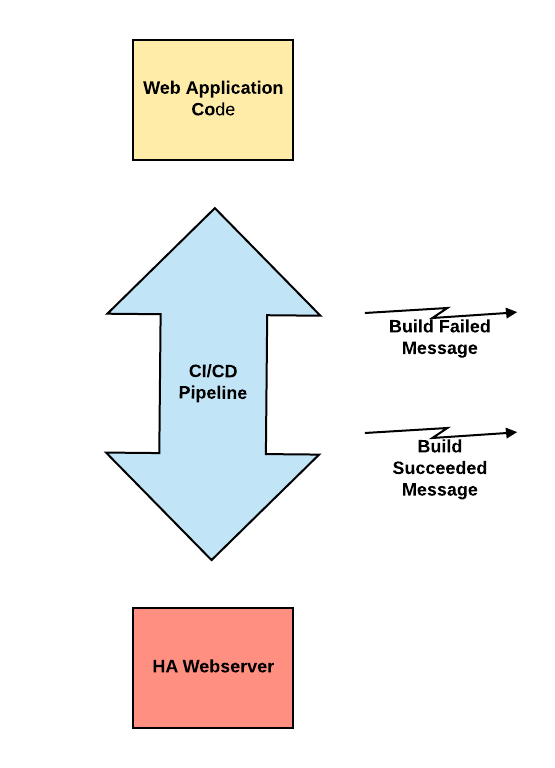
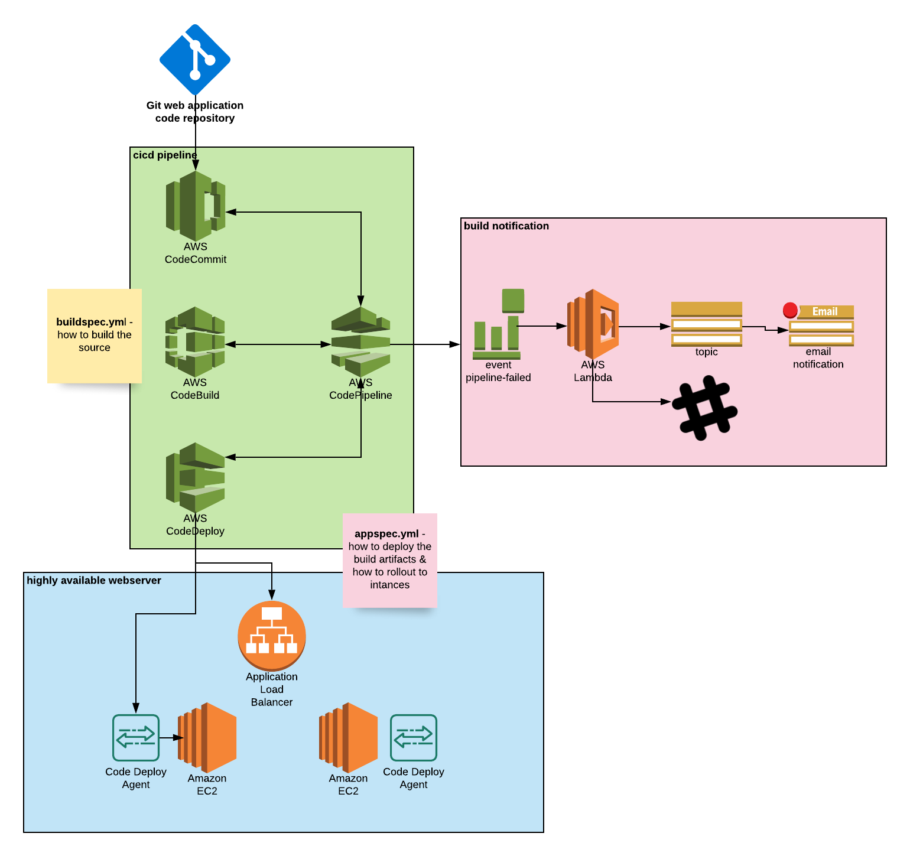

# aws-codepipeline-notif-terraform

## use case

A highly available front-end web application & API with CI/CD build system capable of continuous delivery and Slack/Email build notifications. 

## high level architecture

* web application code repo: https://github.com/AkhilMovva/sample_cool_webapp.git
* cicd pipeline
* webserver
* vpc
* notification

## code pipeline architecture

## development tech stack

* Visual Studio Code with Terraform Extensions
* Terraform.IO Cloud for automated Terraform Planning & Apply
* Github for storing the terraform code

## web application tech stack
* Two AWS EC2 for the webserver(loadbalancer)
* AWS CodeCommit to store the web application code
* AWS Codepipeline, CodeBuild, & CodeDeploy for the CI/CD system

